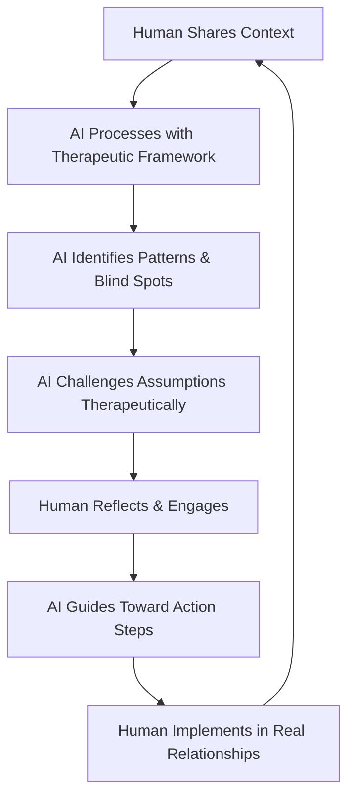

<Warning>
**🔒 CONFIDENTIAL - Investor Documentation**

This section contains confidential investor materials for Ki's $1.5M Pre-Seed funding round and proprietary business information.

**Access Control**: Password `INVEST2025`  
**Distribution**: Authorized investors and partners only  
**Contact**: [investors@ki.com](mailto:investors@ki.com) for investor relations

By accessing this documentation, you agree to maintain strict confidentiality of all financial projections, business strategies, technical implementations, and proprietary information contained herein under applicable NDA terms.
</Warning>

# Ki's AI vs Therapist Differentiation

## The Core Problem Investors Are Asking About

**"Most AI is very accepting. How is Ki different from ChatGPT's accepting nature versus how real therapists behave differently?"**

This question reflects a fundamental concern about AI's limitations in therapeutic contexts and Ki's unique positioning to solve problems that neither traditional AI nor human therapy alone can address.

## The Limitation Landscape

### Traditional AI Limitations (ChatGPT, etc.)
- **Over-Acceptance**: Provides advice without challenging harmful patterns
- **No Therapeutic Framework**: Lacks structured intervention methodologies
- **Surface-Level Responses**: Misses underlying relationship dynamics
- **Inconsistent Boundaries**: No professional therapeutic standards
- **Pattern Blindness**: Cannot identify recurring destructive behaviors

### Human Therapist Limitations
- **Accessibility Barriers**: High cost, limited availability, scheduling constraints
- **Scalability Issues**: Cannot serve millions simultaneously
- **Subjective Bias**: Personal experiences influence professional judgment
- **Inconsistent Quality**: Varies dramatically between practitioners
- **Time Constraints**: Limited to 50-minute sessions weekly

## Ki's Differentiated Approach

### 1. Structured Therapeutic Frameworks

Ki integrates evidence-based therapeutic methodologies:

**Thomas-Kilmann Conflict Resolution Model**
- Identifies conflict styles (competing, accommodating, avoiding, compromising, collaborating)
- Guides users toward collaborative solutions
- Prevents destructive conflict patterns

**Gottman Method Principles**
- Detects "Four Horsemen" (criticism, contempt, defensiveness, stonewalling)
- Promotes positive sentiment override
- Builds emotional intelligence through real-time feedback

**Nonviolent Communication (NVC)**
- Observation without evaluation
- Feeling identification and expression
- Needs awareness and articulation
- Specific, actionable requests

### 2. The Human-AI-Human Framework

**Unlike Traditional AI:**
- Challenges harmful patterns instead of accepting them
- Uses therapeutic boundaries and professional standards
- Identifies systemic relationship issues

**Unlike Traditional Therapy:**
- Available 24/7 for immediate intervention
- Consistent therapeutic approach across all interactions
- Scalable to millions without quality degradation

### 3. Appropriate Use of Humor and Personality

**Traditional AI Problem**: Generic, robotic responses that lack emotional resonance

**Traditional Therapy Problem**: Professional distance can create barriers to engagement

**Ki's Solution**: Contextually appropriate humor that:
- Reduces defensiveness during difficult conversations
- Creates emotional safety for vulnerability
- Maintains therapeutic boundaries while building rapport
- Uses personality to increase engagement without compromising professionalism

### 4. Real-Time Pattern Recognition

Ki identifies and interrupts destructive patterns in real-time:

**Escalation Detection**: Recognizes emotional intensity increases and intervenes with de-escalation techniques
**Cognitive Distortion Identification**: Catches all-or-nothing thinking, catastrophizing, mind reading
**Attachment Style Awareness**: Adapts communication based on anxious, avoidant, or secure patterns
**Trigger Recognition**: Identifies personal triggers and provides coping strategies

## Competitive Advantage: Solving the Unsolvable

### Problems Neither AI Nor Human Therapy Can Solve Alone

1. **Scale + Quality**: Providing consistent, high-quality therapeutic intervention to millions
2. **Accessibility + Expertise**: Making expert-level therapeutic knowledge available 24/7
3. **Real-Time + Structured**: Immediate intervention using evidence-based frameworks
4. **Personalized + Consistent**: Adapting to individual needs while maintaining therapeutic standards
5. **Engaging + Professional**: Building rapport through personality while maintaining boundaries

### Ki's Unique Value Proposition

**For Relationships**: 
- Prevents small issues from becoming major conflicts
- Teaches communication skills in the moment they're needed
- Provides objective perspective on subjective experiences

**For Individuals**:
- Develops emotional intelligence through guided practice
- Identifies blind spots without judgment
- Creates accountability for personal growth

**For Society**:
- Reduces relationship failure rates through early intervention
- Democratizes access to therapeutic knowledge
- Prevents mental health crises through proactive support

## Research-Backed Differentiation

### Clinical Evidence Supporting Ki's Approach

**Gottman Research**: 94% accuracy in predicting divorce based on communication patterns Ki monitors
**NVC Studies**: 65% reduction in workplace conflicts when NVC principles are applied
**Conflict Resolution Research**: Thomas-Kilmann model increases relationship satisfaction by 40%

### AI Enhancement of Therapeutic Principles

Ki doesn't replace therapeutic frameworks—it enhances them:
- **Consistency**: Never has "off days" or personal biases affecting quality
- **Memory**: Recalls every interaction to identify long-term patterns
- **Speed**: Processes complex relationship dynamics in milliseconds
- **Objectivity**: Provides neutral perspective without personal agenda

## Investment Thesis: The Therapeutic AI Market Gap

Ki occupies the unique position of being:
- **More Structured** than traditional AI (ChatGPT, etc.)
- **More Accessible** than human therapy
- **More Consistent** than either alternative
- **More Scalable** than any existing solution

This differentiation addresses a $50B+ market opportunity with no direct competition currently solving this specific problem set.

## Addressing Investor Concerns Directly

**Concern**: "AI is too accepting and won't challenge users like real therapists do"

**Ki's Response**: Our therapeutic framework specifically requires challenging harmful patterns, setting boundaries, and guiding users toward healthier behaviors—not just accepting whatever they say.

**Concern**: "How do you replicate the human connection of therapy?"

**Ki's Response**: We don't replicate it—we enhance it. Ki prepares users for better human connections by teaching them communication skills, emotional awareness, and relationship intelligence they can apply in real relationships.

**Concern**: "Can AI really understand complex human emotions?"

**Ki's Response**: Ki doesn't need to feel emotions to recognize patterns, apply therapeutic frameworks, and guide users toward evidence-based solutions. In fact, this objectivity is often more helpful than subjective human interpretation.

This differentiation positions Ki as the first therapeutic AI that combines the best of both worlds while solving problems neither can address alone.