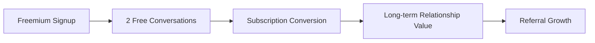
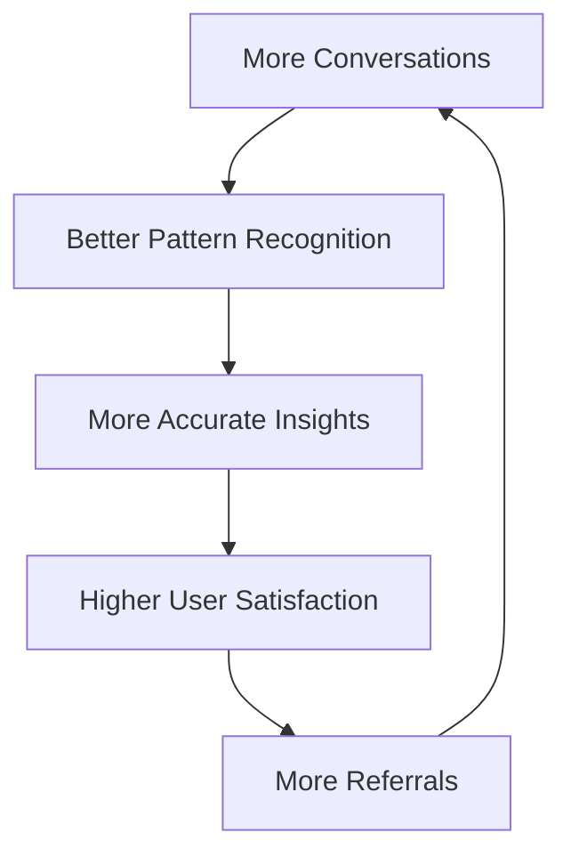

# Business Model & Market Strategy

Ki addresses a massive underserved market with a breakthrough solution that transforms relationship conflicts into connection through affordable, accessible AI-powered relationship intelligence.

## Market Opportunity

### The Crisis We Solve

<CardGroup cols={2}>
<Card title="Marriage Failure Rate" icon="chart-line-down">
  40-50% of marriages fail with couples waiting 6 years before seeking help
</Card>
<Card title="Affordability Crisis" icon="dollar-sign">
  80% of couples can't afford $150-300/session therapy
</Card>
<Card title="Availability Gap" icon="clock">
  24/7 conflicts vs weekly scheduled therapy availability
</Card>
<Card title="Pattern Blindness" icon="eye-slash">
  Couples can't see destructive cycles until damage accumulates
</Card>
</CardGroup>

### Market Size & Opportunity

| Market Segment | Size | Description |
|----------------|------|-------------|
| **Global TAM** | $50B | Total relationship support market |
| **Digital SAM** | $12B | AI-powered relationship platforms |
| **Target SOM** | $3B | Therapy-priced-out couples segment |
| **US Target** | 25M couples | Primary demographic + 100M+ internationally |

<Info>
**Market Timing**: The convergence of AI emotional intelligence, voice processing capabilities, and post-pandemic relationship support needs creates a perfect market opportunity for Ki's Human-AI-Human approach.
</Info>

## Revenue Model

### Freemium Strategy

#### Free Tier
- **2 Free Conversations**: Allow users to experience Ki's relationship intelligence
- **Basic Insights**: Limited pattern recognition and empathy responses
- **Conversion Focus**: Demonstrate value to drive subscription conversion

#### Premium Subscription
- **Pricing**: $19.99/month launch → $29.99/month mature pricing
- **Both Partners Included**: Single subscription covers the entire relationship
- **Unlimited Conversations**: 24/7 access during conflicts and daily check-ins
- **Advanced Features**: Deep pattern recognition, relationship memory, crisis support

### Unit Economics

| Metric | Value | Details |
|--------|-------|---------|
| **LTV** | $450 | Over 18 months average relationship |
| **CAC** | $25-40 | Blended across all acquisition channels |
| **LTV/CAC Ratio** | 12-17x | Exceptional unit economics for SaaS |
| **Gross Margins** | 85%+ | Pure software platform with AI processing costs |
| **Payback Period** | Under 2 months | Rapid return on customer acquisition investment |

### Revenue Expansion Strategy

#### Phase 1: Core B2C Platform (2025-2026)

#### Phase 2: B2B Partnerships (2026-2027)
- **Therapist Integration**: White-label platform for 500+ therapist partners
- **Corporate Wellness**: Employee relationship support programs
- **Health Platform Integration**: Partnerships with telehealth providers

#### Phase 3: Platform Expansion (2027+)
- **Family Dynamics**: Parent-child relationship intelligence
- **Professional Relationships**: Workplace conflict resolution
- **Community Building**: Relationship intelligence social platform

## Growth Projections

### Financial Roadmap

| Year | ARR | Paying Couples | Key Milestones |
|------|-----|----------------|----------------|
| **2025** | $2.2M | 25,000 | Product-market fit, India launch |
| **2026** | $24M | 100,000 | Therapist partnerships, US expansion |
| **2027** | $120M | 400,000 | Global platform, B2B revenue |

### Customer Acquisition Strategy

#### Professional Partnerships (50% of Growth)
- **Therapist Network**: 500+ therapist referral partnerships
- **Clinical Integration**: Ki as therapy support tool between sessions
- **Professional Endorsement**: Clinical validation drives trust and adoption

#### Content Marketing (25% of Growth)
- **Relationship Intelligence Content**: SEO-optimized educational content
- **Pattern Recognition Insights**: Data-driven relationship advice
- **Success Stories**: Anonymized case studies and transformation examples

#### Strategic Partnerships (20% of Growth)
- **Corporate Wellness Programs**: Employee relationship support benefits
- **Health Platform Integration**: Telehealth and mental health app partnerships
- **Insurance Partnerships**: Relationship support as preventive healthcare

#### Viral Referrals (5% of Growth)
- **Relationship Breakthroughs**: Couples naturally share transformative experiences
- **Partner Invitation Flow**: Seamless onboarding for relationship partner
- **Success-Based Sharing**: Couples proud of relationship growth share Ki

## Competitive Positioning

### Current Competitive Landscape

| Competitor | Pricing | Approach | Limitations |
|------------|---------|----------|-------------|
| **Relish** | $240-320/month | Human coaches | Expensive, limited availability |
| **Lasting** | $12/month | Static exercises | No real-time support |
| **Paired** | $9/month | Conversation prompts | Surface-level, no crisis support |
| **BetterHelp** | $240-360/month | Individual therapy | Not couple-focused |

### Ki's Unique Advantage

<Check>
Ki is the **only solution** combining professional therapeutic framework, real-time crisis availability, voice-first emotional intelligence, couples-specific architecture, and affordable professional quality.
</Check>

#### Technical Moat (2-3 Year Lead)
- **Human-AI-Human Framework**: No competitor has dual-partner processing
- **Empathy AI Integration**: Exclusive partnership with Hume AI for emotional voice processing
- **Relationship Memory System**: Long-term contextual intelligence accumulation
- **Privacy Architecture**: Secure multi-party computation for relationships

#### Category Creation
Ki isn't competing in existing categories—we're creating **"Relationship Intelligence"**:
- Fitbit created fitness tracking
- Headspace created digital meditation
- **Ki creates relationship intelligence**

## Go-to-Market Strategy

### India-First Approach

#### Phase 1: Master India Market
- **350M English speakers** with growing digital adoption
- **70% lower CAC** compared to US market
- **Cultural relationship focus** aligns with Ki's strengths
- **Proof of concept** for global expansion

#### Phase 2: South Asian Diaspora
- **US, UK, Canada**: Proven cultural fit and higher LTV
- **Word-of-mouth networks**: Strong community connections
- **Premium pricing power**: Higher income demographics

#### Phase 3: Global English Markets
- **Proven playbook**: Successful India model replication
- **Platform maturity**: Advanced AI and relationship intelligence
- **Network effects**: Global relationship data improves AI for all users

## Investment & Funding Strategy

### Current Funding Round
- **Ask**: $1.5M Pre-Seed
- **Valuation**: $10M Post-Money
- **Timeline**: 18 months to Series A readiness

#### Use of Funds
| Category | Allocation | Purpose |
|----------|------------|---------|
| **Product Development** | 40% | AI advancement, voice processing, mobile apps |
| **Team Expansion** | 35% | Engineering, AI/ML, customer success |
| **Growth Experiments** | 25% | Customer acquisition, partnership development |

### Traction & Validation

#### Early Metrics (Pre-Launch)
- **10% conversion rate** (industry standard: 2-5%) from 16,000 visitors
- **1,600+ conversations** completed with zero marketing spend
- **High trust signals**: Users sharing deeply personal details with AI
- **Clinical endorsement**: Behavioral psychology experts validating approach

#### Product-Market Fit Indicators
- **Organic referrals**: Users independently inviting partners
- **Session frequency**: Multiple conversations per day during conflicts
- **Emotional dependency**: Users expressing genuine care for Ki's responses
- **Professional validation**: Therapists requesting integration partnerships

## Exit Strategy & Valuation

### Strategic Acquirers
- **Google**: Wellness and family products integration
- **Microsoft**: AI + healthcare platform expansion
- **Meta**: Relationships and social connection focus
- **Healthcare Giants**: Relationship health as preventive care

### Market Comparables
| Company | Valuation | Market | Rationale |
|---------|-----------|--------|-----------|
| **Headspace** | $3B | Digital wellness | Created meditation category |
| **BetterHelp** | $7B | Mental health | Therapy accessibility |
| **Bumble** | $8B | Relationships | Relationship platform |

### Target Exit
- **Valuation**: $2-3B (2028-2029)
- **Revenue Multiple**: 15-20x ARR at exit
- **Strategic Value**: Category-defining relationship intelligence platform

## Network Effects & Moats

### Data Flywheel
Every conversation improves Ki's AI for all users (privacy-preserving):

### Professional Network Effects
- **Therapist Partnerships**: Create referral ecosystem
- **Clinical Validation**: Professional endorsement drives adoption
- **B2B Integration**: Multi-sided marketplace for relationship support

### Platform Effects
- **Relationship Memory**: Accumulated intelligence creates switching costs
- **Partner Integration**: Both partners invested in platform
- **Community Building**: Shared relationship growth experiences

## Societal Impact

### Individual Level
- Transform millions of relationships from conflict to connection
- Provide affordable relationship support to underserved couples
- Enable relationship intelligence development and growth

### Societal Level
- Reduce divorce rates through early intervention
- Improve family stability and child outcomes
- Create cultural shift toward relationship intelligence

### Economic Level
- **Preventive Care**: Reduce $1.1B annual therapy spending through early support
- **Productivity**: Healthier relationships improve workplace performance
- **Healthcare Costs**: Better relationships reduce stress-related health issues

<Check>
Ki represents a convergence of advanced AI, proven psychology, and accessible pricing to address a massive underserved market while creating positive societal impact through stronger human relationships.
</Check>

## Next Steps

Ready to explore more about Ki's business strategy?

<CardGroup cols={2}>
<Card title="Market Analysis" href="/docs/ki/market-analysis" icon="chart-line">
  Deep dive into market opportunity and competitive landscape
</Card>
<Card title="Competitive Analysis" href="/docs/ki/competitive-analysis" icon="sword">
  Detailed comparison with existing relationship support solutions
</Card>
<Card title="Success Metrics" href="/docs/ki/success-metrics" icon="target">
  Key performance indicators and measurement framework
</Card>
<Card title="Development Roadmap" href="/docs/ki/development" icon="rocket">
  Technical and business milestones for platform growth
</Card>
</CardGroup>