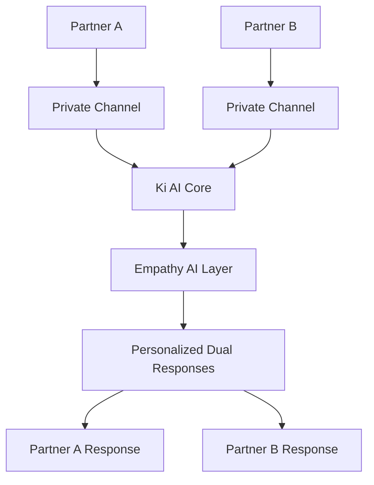

# Ki: Relationship Intelligence Platform

Ki is the world's first Human-AI-Human relationship intelligence platform designed to transform relationship conflicts into connection through AI that understands both partners simultaneously.

## Our Mission

Transform how couples navigate relationships through AI that recognizes patterns invisible to them and guides them toward deeper connection without replacing human intimacy.

## Vision

Create a world where technology strengthens human bonds rather than replacing them, helping millions of couples develop relationship intelligence to transform conflict into connection.

## Core Innovation: Human-AI-Human Framework

Ki's breakthrough technology enables simultaneous processing of both partners while maintaining individual privacy:

<CardGroup cols={2}>
  <Card
    title="Dual-Channel Processing"
    icon="shield-check"
  >
    Each partner has encrypted private communication with Ki plus shared relationship insights
  </Card>
  <Card
    title="Empathy AI Layer"
    icon="heart"
  >
    Emotional intelligence that adapts to each partner's communication style
  </Card>
  <Card
    title="Voice-First Interface"
    icon="microphone"
  >
    Natural conversation during actual conflicts when typing feels impossible
  </Card>
  <Card
    title="Pattern Recognition"
    icon="brain"
  >
    Identifies relationship dynamics invisible to couples themselves
  </Card>
</CardGroup>

## Key Features

### Real-Time Relationship Support
- **24/7 Availability**: Professional-quality guidance whenever conflicts arise
- **Crisis Detection**: Real-time safety monitoring with professional escalation protocols
- **Voice Processing**: Integration with Hume AI for emotional prosody analysis

### Advanced AI Capabilities
- **Relationship Memory**: Long-term contextual understanding that builds over time
- **Dual Processing**: Simultaneous understanding of both partners' perspectives
- **Empathy Modeling**: Adaptive emotional intelligence for each individual

### Privacy & Security
- **Multi-Layer Encryption**: Individual keys, relationship keys, and rotating security
- **Private Channels**: Separate secure channels for each partner
- **HIPAA Compliance**: Healthcare-grade security for sensitive relationship data

## Target Market

### The Crisis Ki Solves
- **40-50% of marriages fail** with couples waiting 6 years before seeking help
- **80% of couples can't afford** $150-300/session therapy
- **24/7 conflicts** vs weekly scheduled therapy availability
- **Pattern blindness**: Couples can't see destructive cycles until damage accumulates

### Market Opportunity
- **$50B Global TAM**: Total relationship support market
- **25M US couples** in target demographic + 100M+ internationally
- **Affordable Alternative**: $25-40/month vs $240-720/month traditional therapy

## Competitive Advantage

Ki is the **only solution** combining:
- Professional therapeutic framework (vs entertainment)
- Real-time crisis availability (vs business hours)
- Voice-first emotional intelligence (vs text during conflicts)
- Couples-specific architecture (vs individual focus)
- Affordable professional quality

### Competitive Landscape
- **Relish** ($240-320/month): Human coaches, expensive, limited availability
- **Lasting** ($12/month): Static exercises, no real-time support
- **Paired** ($9/month): Surface-level conversation prompts
- **BetterHelp** ($240-360/month): Individual therapy, not couple-focused

## Getting Started

Ready to explore Ki's capabilities? Check out our comprehensive documentation:

<CardGroup cols={2}>
  <Card
    title="Technical Architecture"
    icon="cpu"
    href="/ki/technical-architecture"
  >
    Deep dive into Ki's Human-AI-Human framework and LangGraph implementation
  </Card>
  <Card
    title="User Experience Design"
    icon="palette"
    href="/ki/user-experience"
  >
    Learn about Ki's conversational design principles and emotional adaptation
  </Card>
  <Card
    title="Business Model"
    icon="chart-line"
    href="/ki/business-model"
  >
    Understand Ki's market positioning and financial strategy
  </Card>
  <Card
    title="Development Guide"
    icon="code"
    href="/development/setup"
  >
    Start building with Ki's platform and contributing to the codebase
  </Card>
</CardGroup>

## Demo & Links

Experience Ki in action:
- **Demo Platform**: [app.demo.ki.com](https://app.demo.ki.com)
- **GitHub**: [ki-platform](https://github.com/sinhadanish/ki-platform)

---

*Ki represents the convergence of advanced AI emotional intelligence, proven relationship psychology, and accessible pricing to create an entirely new market category at the intersection of technology and human connection.*