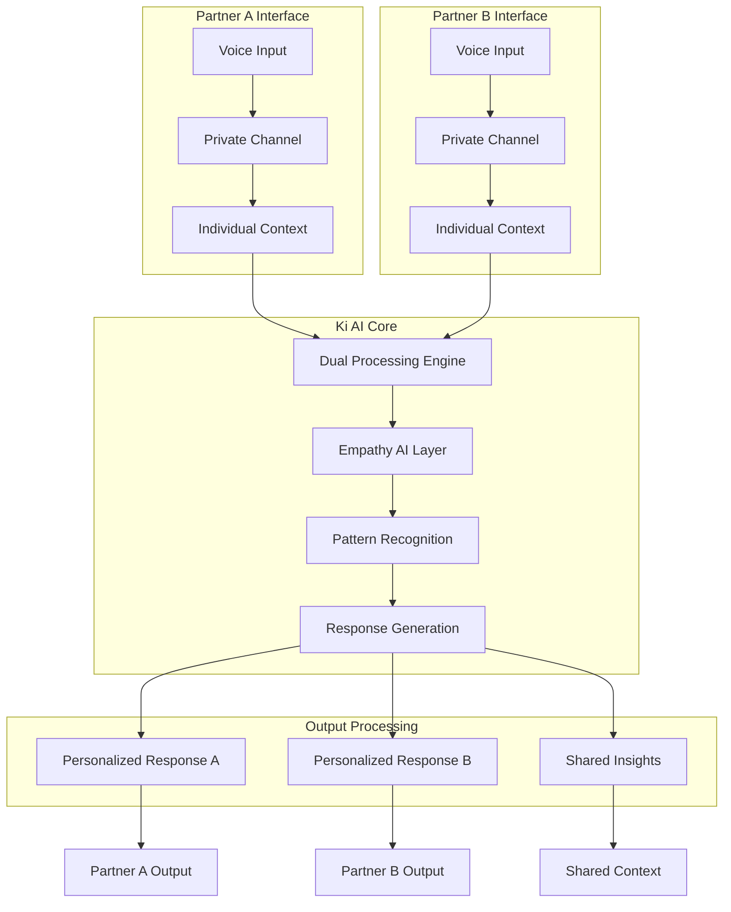

# Technical Architecture

Ki's technical architecture is built around our revolutionary **Human-AI-Human framework** that enables simultaneous processing of both partners in a relationship while maintaining individual privacy and security.

## Core Architecture Overview

### Human-AI-Human Framework

Our breakthrough innovation allows Ki to understand and respond to both partners simultaneously:



## LangGraph Implementation

Ki's AI engine is built using LangGraph, providing sophisticated workflow processing with multiple specialized nodes:

<Tabs>
<Tab title="Processing Flow">

### Core Processing Workflow

```python
# Ki Relationship Intelligence Graph
intake → safety_check → emotional_analysis → conflict_detection 
→ anxiety_detection → empathy_processing → pattern_recognition 
→ response_generation → memory_update
```

**Processing Steps:**

1. **Intake Node**: Receives and preprocesses partner inputs
2. **Safety Check**: Monitors for crisis situations requiring professional intervention
3. **Emotional Analysis**: Processes emotional states using Hume AI integration
4. **Conflict Detection**: Identifies relationship dynamics using Thomas-Kilmann styles
5. **Anxiety Detection**: Monitors stress levels and emotional regulation
6. **Empathy Processing**: Generates empathetic understanding for each partner
7. **Pattern Recognition**: Identifies recurring relationship dynamics
8. **Response Generation**: Creates personalized responses for each partner
9. **Memory Update**: Updates long-term relationship context

</Tab>
<Tab title="Node Architecture">

### LangGraph Node Implementation

```python
from langgraph import StateGraph, Annotation
from typing_extensions import TypedDict

class KiRelationshipState(TypedDict):
    partner_a_input: str
    partner_b_input: str
    emotional_states: dict
    conflict_style: str
    anxiety_levels: dict
    empathy_context: dict
    relationship_patterns: list
    responses: dict
    safety_status: str

# Core processing nodes
def intake_node(state: KiRelationshipState) -> KiRelationshipState:
    """Process initial partner inputs with privacy separation"""
    
def safety_check_node(state: KiRelationshipState) -> KiRelationshipState:
    """Monitor for crisis situations requiring intervention"""
    
def emotional_analysis_node(state: KiRelationshipState) -> KiRelationshipState:
    """Analyze emotional states using Hume AI integration"""
    
def empathy_processing_node(state: KiRelationshipState) -> KiRelationshipState:
    """Generate empathetic understanding for each partner"""
```

</Tab>
<Tab title="State Management">

### Relationship State Architecture

```python
class RelationshipMemory:
    """Long-term contextual understanding system"""
    
    def __init__(self):
        self.individual_contexts = {
            'partner_a': IndividualContext(),
            'partner_b': IndividualContext()
        }
        self.shared_context = SharedContext()
        self.pattern_history = PatternHistory()
        
    def update_memory(self, conversation_data):
        """Update relationship understanding"""
        self._update_individual_patterns()
        self._update_shared_dynamics()
        self._detect_growth_opportunities()

class IndividualContext:
    """Private context for each partner"""
    attachment_style: str
    communication_preferences: dict
    emotional_patterns: list
    triggers: list
    growth_areas: list

class SharedContext:
    """Consensual shared relationship insights"""
    relationship_stage: str
    common_goals: list
    conflict_patterns: list
    strength_areas: list
    improvement_opportunities: list
```

</Tab>
</Tabs>

## System Components

### 1. Dual-Channel Processing

<Info>
**Privacy-First Design**: Each partner has completely separate processing channels that only merge at the empathy layer with explicit consent.
</Info>

#### Individual Processing Channels
- **Encrypted Communication**: Each partner's input is processed in isolation
- **Personal Context**: Individual attachment styles, communication preferences, triggers
- **Private Insights**: Partner-specific observations and recommendations
- **Consent Management**: Granular control over what information is shared

#### Shared Processing Layer
- **Empathy Integration**: Understanding both perspectives simultaneously
- **Pattern Recognition**: Identifying relationship dynamics across both partners
- **Collaborative Insights**: Shared observations that benefit the relationship
- **Growth Opportunities**: Joint development areas and strengths

### 2. Empathy AI Layer

#### Emotional Intelligence Components
```python
class EmpathyAI:
    """Core empathy processing system"""
    
    def process_emotional_state(self, voice_data, text_data):
        """Analyze emotional prosody and content"""
        prosody_analysis = self.hume_ai.analyze_prosody(voice_data)
        content_analysis = self.llm.analyze_content(text_data)
        return self.synthesize_emotional_state(prosody_analysis, content_analysis)
    
    def generate_empathetic_response(self, emotional_state, context):
        """Create emotionally intelligent responses"""
        empathy_level = self.determine_empathy_needs(emotional_state)
        response_style = self.adapt_communication_style(context)
        return self.craft_response(empathy_level, response_style)
```

#### Voice Processing Integration
- **Hume AI Integration**: Real-time emotional prosody analysis
- **Voice-First Design**: Natural conversation during conflicts
- **Emotional Adaptation**: Response timing and tone adaptation
- **Crisis Detection**: Voice pattern analysis for safety monitoring

### 3. Pattern Recognition System

#### Relationship Dynamics Detection
```python
class PatternRecognition:
    """Identifies relationship patterns and dynamics"""
    
    def detect_conflict_styles(self, interaction_data):
        """Thomas-Kilmann conflict style analysis"""
        return {
            'competing': self.analyze_competing_behaviors(),
            'accommodating': self.analyze_accommodating_patterns(),
            'avoiding': self.analyze_avoidance_patterns(),
            'collaborating': self.analyze_collaborative_efforts(),
            'compromising': self.analyze_compromise_tendencies()
        }
    
    def identify_growth_patterns(self, historical_data):
        """Track relationship evolution and growth"""
        return {
            'communication_improvements': self.track_communication_growth(),
            'conflict_resolution_progress': self.monitor_resolution_skills(),
            'intimacy_development': self.assess_emotional_connection(),
            'individual_growth': self.track_personal_development()
        }
```

## Technical Infrastructure

### Stack Overview

<Tabs>
<Tab title="Frontend">

#### Frontend Architecture
- **Framework**: Next.js 15 with App Router (React 19.1.0)
- **UI Components**: Radix UI primitives with shadcn/ui design system
- **Styling**: Tailwind CSS with emotional state adaptations
- **Voice Interface**: WebRTC with real-time audio processing
- **State Management**: Zustand for global state, React Query for server state
- **Real-time**: WebSocket connections for live conversation

#### Emotional UI Adaptation
```typescript
interface EmotionalState {
  primary_emotion: string
  intensity: number
  arousal: number
  valence: number
}

class EmotionalUIAdapter {
  adaptInterface(emotionalState: EmotionalState) {
    return {
      colors: this.generateEmotionalColorPalette(emotionalState),
      animations: this.adjustAnimationTiming(emotionalState),
      layout: this.optimizeLayoutForState(emotionalState),
      voice: this.configureVoiceSettings(emotionalState)
    }
  }
}
```

</Tab>
<Tab title="Backend">

#### Backend Services
- **AI Engine**: FastAPI (Python 3.11+) with LangGraph orchestration
- **API Layer**: Next.js API routes for frontend integration
- **Database**: PostgreSQL with Prisma ORM + Neon serverless
- **Cache**: Redis for session management and real-time data
- **Authentication**: Clerk with relationship-aware permissions
- **File Storage**: Encrypted cloud storage for conversation history

#### API Architecture
```python
from fastapi import FastAPI, WebSocket
from langchain_core.runnables import RunnableConfig

app = FastAPI()

@app.websocket("/ws/conversation/{relationship_id}")
async def conversation_websocket(websocket: WebSocket, relationship_id: str):
    """Real-time conversation processing"""
    await websocket.accept()
    
    while True:
        # Receive partner input
        data = await websocket.receive_json()
        
        # Process through Ki graph
        config = RunnableConfig(configurable={"relationship_id": relationship_id})
        result = await ki_graph.ainvoke(data, config)
        
        # Send personalized responses
        await websocket.send_json(result)
```

</Tab>
<Tab title="AI/ML">

#### AI/ML Stack
- **LLMs**: OpenAI GPT-4 + Anthropic Claude for different processing stages
- **Orchestration**: LangGraph for complex workflow management
- **Emotional AI**: Hume AI for voice prosody analysis
- **Vector Store**: Pinecone for semantic relationship memory
- **Monitoring**: LangSmith for AI pipeline observability

#### Model Integration
```python
class KiAIOrchestrator:
    def __init__(self):
        self.openai_client = OpenAI()
        self.anthropic_client = Anthropic()
        self.hume_client = HumeAI()
        self.vector_store = PineconeStore()
    
    async def process_relationship_input(self, partner_a_data, partner_b_data):
        """Orchestrate multi-model processing"""
        
        # Emotional analysis with Hume AI
        emotions_a = await self.hume_client.analyze_prosody(partner_a_data.audio)
        emotions_b = await self.hume_client.analyze_prosody(partner_b_data.audio)
        
        # Content understanding with GPT-4
        content_analysis = await self.openai_client.analyze_content({
            'partner_a': partner_a_data.text,
            'partner_b': partner_b_data.text
        })
        
        # Empathetic response generation with Claude
        empathetic_responses = await self.anthropic_client.generate_responses({
            'emotions': [emotions_a, emotions_b],
            'content': content_analysis,
            'relationship_context': self.get_relationship_context()
        })
        
        return empathetic_responses
```

</Tab>
<Tab title="Infrastructure">

#### Production Infrastructure
- **Deployment**: Vercel with edge functions for global distribution
- **Database**: Neon PostgreSQL with automatic scaling
- **Monitoring**: Sentry for error tracking + PostHog for analytics
- **Security**: Arcjet for DDoS protection and rate limiting
- **CDN**: Vercel Edge Network for global content delivery

#### Security Architecture
```python
class SecurityLayer:
    """Multi-layered security for relationship data"""
    
    def __init__(self):
        self.encryption = AESEncryption()
        self.key_manager = RelationshipKeyManager()
        self.access_control = RelationshipACL()
    
    def encrypt_partner_data(self, partner_id, data):
        """Individual partner encryption"""
        partner_key = self.key_manager.get_partner_key(partner_id)
        return self.encryption.encrypt(data, partner_key)
    
    def create_shared_context(self, partner_a_id, partner_b_id, data):
        """Consensual shared data with dual consent"""
        if not self.access_control.both_partners_consent(partner_a_id, partner_b_id):
            raise PermissionDenied("Shared context requires both partners' consent")
        
        shared_key = self.key_manager.get_relationship_key(partner_a_id, partner_b_id)
        return self.encryption.encrypt(data, shared_key)
```

</Tab>
</Tabs>

## Performance & Scalability

### Response Time Targets
- **Voice Response**: Under 100ms for emotional acknowledgment
- **Full Analysis**: Under 2 seconds for complete relationship insight
- **Pattern Recognition**: Under 5 seconds for complex dynamic analysis
- **Memory Update**: Background processing without blocking user interaction

### Scalability Architecture
```python
class ScalabilityLayer:
    """Handle 10,000+ concurrent conversations"""
    
    async def route_conversation(self, relationship_id):
        """Intelligent routing for optimal performance"""
        
        # Determine processing complexity
        complexity = await self.assess_conversation_complexity(relationship_id)
        
        # Route to appropriate processing tier
        if complexity.is_crisis:
            return await self.crisis_processing_tier(relationship_id)
        elif complexity.is_complex:
            return await self.advanced_processing_tier(relationship_id)
        else:
            return await self.standard_processing_tier(relationship_id)
```

<Warning>
**Privacy Notice**: All technical implementations prioritize relationship data privacy with end-to-end encryption, consent-based sharing, and zero-knowledge architecture where possible.
</Warning>

## Next Steps

Ready to dive deeper into Ki's technical implementation?

<CardGroup cols={2}>
<Card title="Emotional Intelligence System" href="/docs/ki/emotional-intelligence">
  Deep dive into Ki's emotional processing capabilities
</Card>
<Card title="Voice Interface Implementation" href="/docs/ki/voice-interface">
  Explore real-time voice processing architecture
</Card>
<Card title="Development Guide" href="/docs/ki/development">
  Start building with Ki's development tools
</Card>
<Card title="API Reference" href="/docs/ki/api-reference">
  Complete API documentation and examples
</Card>
</CardGroup>