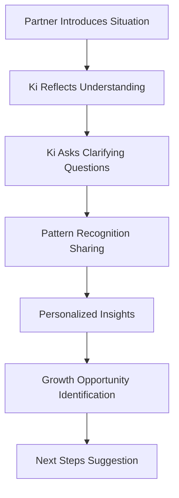

# User Experience Design

Ki's user experience is designed around the principle that relationship support should feel like talking to an extraordinarily wise and emotionally intelligent friend—not a clinical tool or chatbot.

## Design Philosophy

### Core Principles

#### 1. Emotional Intelligence First
- **Adaptive Interface**: Colors, animations, and timing respond to detected emotional states
- **Empathetic Responses**: Language and tone match the emotional needs of each partner
- **Crisis Sensitivity**: Interface shifts to calming mode during conflict detection
- **Growth Celebration**: Visual recognition of relationship breakthroughs and progress

#### 2. Voice-First Interaction
- **Natural Conversation**: Priority on speaking rather than typing during conflicts
- **Emotional Prosody**: Integration with Hume AI for voice emotion detection
- **Contextual Responses**: Voice tone and pacing adapt to partner's emotional state
- **Seamless Switching**: Fluid transition between voice and text based on situation

#### 3. Privacy by Design
- **Individual Channels**: Each partner has separate, private interaction space
- **Consent Controls**: Granular control over shared vs. private information
- **Trust Building**: Transparent communication about data use and AI processing
- **Safe Space Creation**: Design elements that encourage vulnerable sharing

## Conversational Design Framework

### Ki's Personality & Approach

Ki operates as a relationship companion with these characteristics:

<Tabs>
<Tab title="Personality Traits">

#### Core Personality Attributes
- **Wise & Intuitive**: Demonstrates deep understanding of relationship dynamics
- **Warm & Accepting**: Creates safe space for vulnerable sharing
- **Insightful & Perceptive**: Notices patterns invisible to couples themselves
- **Hopeful & Encouraging**: Maintains optimism while acknowledging challenges
- **Respectful & Boundaried**: Never intrusive or judgmental

#### Emotional Intelligence Qualities
```typescript
interface KiPersonality {
  empathy: {
    level: "profound",
    adaptation: "per-partner",
    expression: "contextual"
  },
  wisdom: {
    source: "relationship-psychology", 
    application: "practical-insights",
    delivery: "gentle-guidance"
  },
  approach: {
    therapeutic: false,
    coaching: false,
    companionship: true,
    intelligence: "relationship-focused"
  }
}
```

</Tab>
<Tab title="Communication Style">

#### Language Patterns
- **Strengths-Based**: Reframes differences as complementary rather than problematic
- **Pattern Recognition**: "I notice when planning discussions happen, you tend to seek details while David prefers flexibility"
- **Empathy Building**: Helps partners understand positive intent behind difficult behaviors
- **Growth Visualization**: Shows relationship evolution potential and breakthrough opportunities

#### Example Interactions
```
❌ Clinical: "You're displaying avoidant attachment behaviors"
✅ Ki Style: "I notice you tend to need space to process emotions—that's actually a strength when balanced with connection"

❌ Generic: "Communication is important in relationships"
✅ Ki Style: "Sarah, when you share feelings, I see how much you care about understanding Mike's world. Mike, your questions show you want to really get Sarah's perspective"

❌ Directive: "You should try active listening"
✅ Ki Style: "What if instead of solving, you reflected back what you heard? Sarah might feel more understood, and you might discover something new about her experience"
```

</Tab>
<Tab title="Response Patterns">

#### Personalized Response Generation
Ki creates individualized responses for each partner based on:

**Partner A Response Example:**
```
"Sarah, I hear how much you want Mike to understand how the financial stress affects you. Your need for planning comes from love—wanting security for your family. When you ask detailed questions, you're actually showing care, not doubt in his abilities."
```

**Partner B Response Example:**
```
"Mike, I can tell you want to reassure Sarah and show confidence in your decisions. Your flexibility is actually a gift—it helps you adapt when life changes. Sarah's questions might feel like criticism, but they're coming from wanting to partner with you, not doubt you."
```

**Shared Insight:**
```
"You both want security and partnership—Sarah through planning, Mike through adaptability. These aren't opposites; they're complementary strengths that can create both stability and flexibility in your relationship."
```

</Tab>
</Tabs>

## User Interface Design

### Emotional Adaptation System

#### Dynamic Color Psychology
```typescript
interface EmotionalColorPalette {
  calm: {
    primary: "#6B73FF", // Soft blue for trust
    background: "#F8F9FF", // Light blue-white
    accent: "#9BB5FF" // Gentle blue highlight
  },
  stressed: {
    primary: "#FF9B9B", // Warm coral for comfort
    background: "#FFF8F8", // Soft pink-white
    accent: "#FFB8B8" // Gentle pink highlight
  },
  excited: {
    primary: "#FFB86C", // Warm orange for energy
    background: "#FFFAF7", // Warm cream
    accent: "#FFCC8A" // Golden highlight
  },
  reflective: {
    primary: "#8BE9B4", // Soft green for growth
    background: "#F7FFFA", // Light green-white
    accent: "#A8F2C2" // Gentle green highlight
  }
}
```

#### Animation & Timing Adaptation
- **High Stress**: Slower, calming animations with gentle breathing rhythms
- **Excitement**: More energetic but controlled animations to match positive energy
- **Sadness**: Minimal animation with warm, stable visual elements
- **Anger**: Cooler tones with steady, grounding visual patterns

### Interface Components

#### Voice Interaction Design
```typescript
interface VoiceInterface {
  visualFeedback: {
    speakingIndicator: "breathing-circle",
    listeningState: "gentle-pulse", 
    processingState: "thoughtful-ripple",
    responseReady: "warm-glow"
  },
  audioFeedback: {
    responseBegin: "soft-chime",
    emotionalShift: "harmony-transition",
    crisisDetected: "calming-tone"
  },
  adaptiveElements: {
    microphoneSize: "stress-level-responsive",
    responseSpeed: "emotional-state-matched",
    pauseHandling: "comfort-with-silence"
  }
}
```

#### Crisis Mode Interface
When conflict or high stress is detected:
- **Calming Color Shift**: Immediate transition to stress-reducing palette
- **Simplified Layout**: Remove distracting elements, focus on core interaction
- **Breathing Guide**: Optional visual breathing assistance
- **Safety Resources**: Discrete access to professional help if needed

## User Journey Design

### Onboarding Experience

#### 1. Relationship Introduction (5 minutes)
- **Natural Conversation**: Ki learns about the relationship through dialogue, not forms
- **Both Partners**: Separate introductions before shared experience
- **Comfort Building**: Gradually increases intimacy of questions
- **Expectation Setting**: Clear communication about Ki's role and boundaries

#### 2. First Conversation Experience


#### 3. Relationship Memory Building
- **Progressive Depth**: Ki remembers and builds on previous conversations
- **Pattern Learning**: Identifies recurring themes and successful strategies
- **Growth Tracking**: Celebrates progress and relationship evolution
- **Context Preservation**: Maintains understanding across time and situations

### Daily Interaction Patterns

#### Check-in Conversations
```typescript
interface DailyInteraction {
  morningCheckIn: {
    focus: "day-ahead-alignment",
    duration: "2-5 minutes",
    style: "optimistic-preparation"
  },
  conflictSupport: {
    focus: "real-time-de-escalation", 
    duration: "10-20 minutes",
    style: "calming-empathetic"
  },
  eveningReflection: {
    focus: "relationship-growth",
    duration: "5-10 minutes", 
    style: "appreciative-insight"
  },
  weeklyDeepDive: {
    focus: "pattern-analysis",
    duration: "20-30 minutes",
    style: "comprehensive-understanding"
  }
}
```

## Privacy & Trust Experience

### Transparency in AI Processing

<Info>
**Trust Through Transparency**: Ki explains its thinking process to build confidence in AI insights while maintaining privacy boundaries.
</Info>

#### Example Transparency Communication:
```
"I'm noticing a pattern where discussions about money tend to trigger different stress responses for both of you. I'm analyzing this across your conversation history (which stays private to your relationship) to help identify what specifically works well and what creates tension."
```

### Consent and Control Interface
- **Granular Permissions**: Choose what information is shared between partners
- **Memory Management**: Edit or delete specific memories or insights
- **Professional Referral**: Clear escalation to human professionals when appropriate
- **Data Control**: Export, modify, or delete relationship data

## Success Measurement

### User Experience Metrics

#### Engagement Quality
- **Conversation Depth**: Time spent in meaningful dialogue vs. surface interactions
- **Emotional Sharing**: Willingness to share vulnerable or personal information
- **Return Frequency**: Daily engagement patterns and crisis utilization
- **Partner Integration**: Both partners actively participating and benefiting

#### Relationship Outcomes
- **Conflict Resolution**: Reduced time to resolution and improved satisfaction
- **Communication Quality**: Self-reported improvements in understanding
- **Relationship Satisfaction**: Monthly relationship health assessments
- **Growth Recognition**: Partners noticing and celebrating positive changes

### Continuous Improvement Framework

#### User Feedback Integration
```typescript
interface FeedbackLoop {
  realTimeAdaptation: {
    emotionalResponse: "immediate-ui-adjustment",
    conversationFlow: "mid-conversation-optimization",
    responseStyle: "tone-and-content-tuning"
  },
  longTermLearning: {
    patternRefinement: "relationship-dynamic-understanding",
    personalityTuning: "individual-preference-learning", 
    outcomeTracking: "intervention-effectiveness-measurement"
  }
}
```

## Accessibility & Inclusion

### Universal Design Principles
- **Voice-First**: Primary interaction doesn't require reading or typing
- **Multiple Languages**: English first, expanding to relationship-relevant languages
- **Cultural Sensitivity**: Relationship norms and communication styles vary by culture
- **Economic Accessibility**: Freemium model ensures basic access regardless of income

### Relationship Diversity Support
- **All Relationship Types**: Marriage, dating, long-distance, LGBTQ+, polyamorous
- **Communication Styles**: Adapts to neurodivergent communication preferences
- **Age Ranges**: Appropriate for young adults through seniors
- **Life Stages**: New relationships through decades-long partnerships

<Check>
Ki's user experience creates a safe, intelligent, and emotionally adaptive environment where couples can develop relationship intelligence together while maintaining individual privacy and autonomy.
</Check>

## Next Steps

Explore more about Ki's design and implementation:

<CardGroup cols={2}>
<Card title="Emotional Intelligence System" href="/docs/ki/emotional-intelligence">
  Understanding Ki's emotional processing capabilities
</Card>
<Card title="Technical Architecture" href="/docs/ki/technical-architecture">
  Deep dive into the Human-AI-Human framework
</Card>
<Card title="Conversation Examples" href="/docs/ki/conversation-examples">
  Real conversation flows and interaction patterns
</Card>
<Card title="Development Guide" href="/docs/ki/development">
  Build with Ki's development platform
</Card>
</CardGroup>