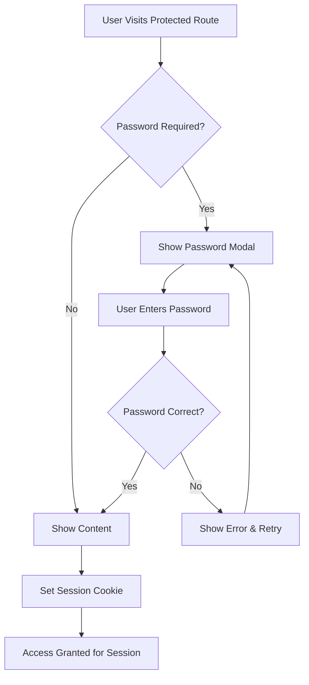

# Three-Tier Documentation Architecture

## Overview

Ki's documentation system implements a three-tier access architecture to serve different audience needs while maintaining security and appropriate information disclosure.

## Tier Structure

### Tier 1: Public User Documentation
**Access Level**: Open (No Password Required)
**Audience**: Potential users, existing users, general public
**URL Path**: `/` (root documentation)

**Content Categories:**
- **Platform Overview**: What Ki does and how it helps relationships
- **User Guides**: How to use Ki's features effectively
- **Getting Started**: Onboarding and setup instructions
- **FAQ**: Common questions about using Ki
- **Privacy & Security**: User data protection information
- **Support**: Contact information and help resources

**Navigation Structure:**
```
Welcome
├── Introduction
├── Getting Started
└── User Guide

Ki Platform (Public)
├── How It Works
├── Features Overview
├── Privacy & Security
└── FAQ

Support
├── Contact Us
├── Help Center
└── Community
```

### Tier 2: Internal Technical Documentation
**Access Level**: Password Protected (`TECH2025`)
**Audience**: Development team, technical partners, contractors
**URL Path**: `/internal` or `/tech`

**Content Categories:**
- **Architecture Documentation**: Technical system design
- **API Documentation**: Internal APIs and integrations
- **Development Guides**: Setup, deployment, debugging
- **Code Standards**: Development best practices
- **Infrastructure**: DevOps, monitoring, scaling
- **Security Protocols**: Technical security implementation
- **Testing Strategies**: QA processes and test coverage
- **Performance Metrics**: System performance and optimization

**Navigation Structure:**
```
Development
├── Setup & Installation
├── Architecture Overview
├── API Reference
└── Code Standards

Technical Implementation
├── LangGraph AI Engine
├── Human-AI-Human Framework
├── Database Design
└── Security Implementation

Operations
├── Deployment Guide
├── Monitoring & Analytics
├── Performance Optimization
└── Troubleshooting
```

### Tier 3: Investor Portal
**Access Level**: Password Protected (`INVEST2025`)
**Audience**: Current and potential investors, advisors, board members
**URL Path**: `/investor`
**Interface Style**: Slide-based presentation (Y Combinator style)

**Content Categories:**
- **Executive Summary**: Investment thesis and opportunity
- **Market Analysis**: TAM, competition, positioning
- **Product Intelligence**: Technology differentiation
- **Financial Projections**: Revenue models, unit economics
- **Team & Organization**: Founder profiles, hiring plans
- **Fundraising Information**: Current round, use of funds
- **Metrics Dashboard**: User growth, engagement, revenue
- **Risk Assessment**: Technical and market risks
- **Exit Strategy**: Long-term vision and acquisition potential

**Navigation Structure (Slide-Based):**
```
Slide Deck Navigation
├── Executive Summary (Slides 1-3)
├── Problem & Solution (Slides 4-7)
├── Market Opportunity (Slides 8-12)
├── Product Demo (Slides 13-17)
├── Business Model (Slides 18-22)
├── Financial Projections (Slides 23-27)
├── Team & Advisors (Slides 28-30)
├── Funding & Use of Funds (Slides 31-33)
└── Appendix (Slides 34+)

Interactive Sections
├── Live Metrics Dashboard
├── AI vs Therapist Differentiation
├── Competitive Analysis Deep Dive
└── Technical Architecture Details
```

## Implementation Architecture

### Password Protection System

#### Authentication Flow


#### Technical Implementation
- **Session Management**: Secure HTTP-only cookies with 24-hour expiration
- **Password Storage**: Hashed passwords stored in environment variables
- **Route Protection**: Middleware checks authentication before rendering
- **Multiple Tiers**: Different passwords for different access levels

### Mintlify Configuration

#### Environment Variables
```bash
# Password hashes for different tiers
TECH_PASSWORD_HASH=<bcrypt_hash_of_TECH2025>
INVESTOR_PASSWORD_HASH=<bcrypt_hash_of_INVEST2025>

# Session configuration
SESSION_SECRET=<random_secret_key>
SESSION_DURATION=86400 # 24 hours
```

#### Custom Authentication Component
```typescript
// components/auth/PasswordProtection.tsx
interface PasswordProtectionProps {
  tier: 'tech' | 'investor'
  children: React.ReactNode
}

export function PasswordProtection({ tier, children }: PasswordProtectionProps) {
  // Implementation handles password checking and session management
}
```

#### Route Protection Middleware
```typescript
// middleware.ts
export function middleware(request: NextRequest) {
  const { pathname } = request.nextUrl
  
  // Check if route requires authentication
  if (pathname.startsWith('/internal') || pathname.startsWith('/tech')) {
    return checkTechAuth(request)
  }
  
  if (pathname.startsWith('/investor')) {
    return checkInvestorAuth(request)
  }
  
  return NextResponse.next()
}
```

### Slide-Based Investor Interface

#### Y Combinator Style Implementation
- **Navigation**: Slide counter (e.g., "12 / 35") with prev/next buttons
- **Keyboard Controls**: Arrow keys, space bar, page up/down
- **Progress Indicator**: Visual progress bar showing completion
- **Full-Screen Mode**: Option to present in full-screen
- **Print Support**: Clean PDF export of all slides
- **Mobile Responsive**: Touch swipe navigation on mobile

#### Slide Components
```typescript
// components/investor/SlideNavigation.tsx
interface SlideNavigationProps {
  currentSlide: number
  totalSlides: number
  onNext: () => void
  onPrev: () => void
}

// components/investor/SlideContainer.tsx
interface SlideContainerProps {
  slideNumber: number
  title: string
  children: React.ReactNode
}
```

## Content Organization Strategy

### Public Documentation (Tier 1)
**Goal**: Convert visitors to users, provide excellent user experience

**Key Pages:**
1. **Introduction**: Welcoming overview of Ki's mission
2. **How Ki Works**: Human-AI-Human framework explanation (non-technical)
3. **Getting Started**: User onboarding guide
4. **Features**: Voice interface, pattern recognition, insights
5. **Privacy**: Data protection and security for users
6. **Support**: Help, FAQ, contact information

### Technical Documentation (Tier 2)
**Goal**: Enable development team productivity and technical partnerships

**Key Sections:**
1. **Architecture**: System design, LangGraph implementation
2. **API Reference**: Endpoint documentation, authentication
3. **Development Setup**: Local environment, testing, deployment
4. **Therapeutic Frameworks**: Technical implementation of therapy models
5. **Performance**: Optimization, monitoring, scaling strategies
6. **Security**: Technical security measures, compliance

### Investor Portal (Tier 3)
**Goal**: Secure funding, provide transparency to investors

**Key Slide Categories:**
1. **Opportunity Slides**: Problem, solution, market size
2. **Product Slides**: Demo, differentiation, technology moat
3. **Business Slides**: Model, revenue, unit economics
4. **Financial Slides**: Projections, fundraising, use of funds
5. **Team Slides**: Founder profiles, advisor network
6. **Appendix Slides**: Detailed metrics, technical deep dives

## Security Considerations

### Password Security
- **Strength Requirements**: Minimum complexity for access passwords
- **Rotation Policy**: Regular password updates (quarterly)
- **Audit Logging**: Track access attempts and successful logins
- **Session Management**: Secure logout, session timeout

### Content Security
- **Sensitive Information**: Proper classification and access controls
- **Data Protection**: No customer data in investor materials
- **IP Protection**: Watermarking on sensitive technical diagrams
- **Download Controls**: Prevent bulk downloading of protected content

### Access Monitoring
- **Analytics**: Track which sections are most accessed
- **User Behavior**: Understanding investor interests and concerns
- **Security Alerts**: Notifications for unusual access patterns
- **Compliance**: Ensure access logs meet regulatory requirements

## User Experience Design

### Seamless Transitions
- **Consistent Branding**: Ki colors, fonts, and design language across all tiers
- **Smooth Navigation**: Clear indicators of current access level
- **Progressive Disclosure**: Guide users to appropriate content for their needs
- **Mobile Optimization**: All tiers work excellently on mobile devices

### Accessibility
- **WCAG Compliance**: Meet accessibility standards across all tiers
- **Keyboard Navigation**: Full keyboard support, especially for slides
- **Screen Reader Support**: Proper ARIA labels and semantic HTML
- **Color Contrast**: Ensure readability for all users

This three-tier architecture provides appropriate information access while maintaining security and delivering excellent user experiences for each distinct audience.